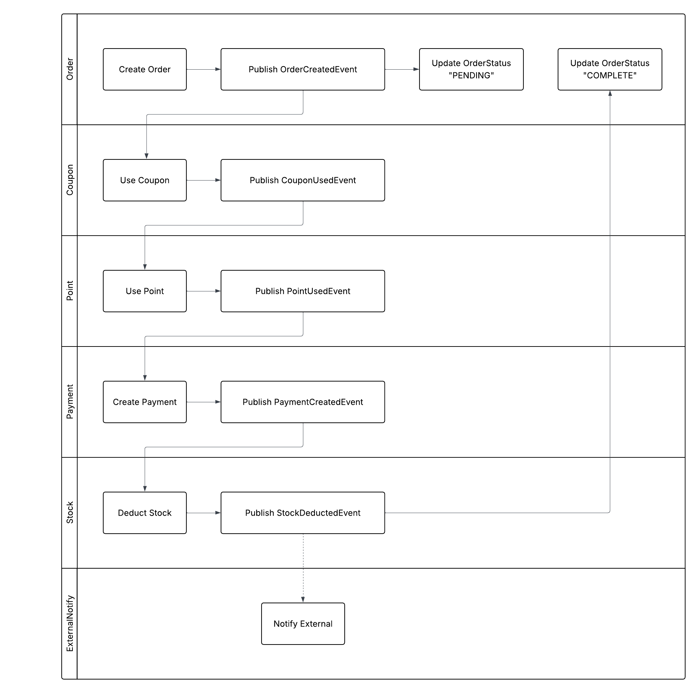
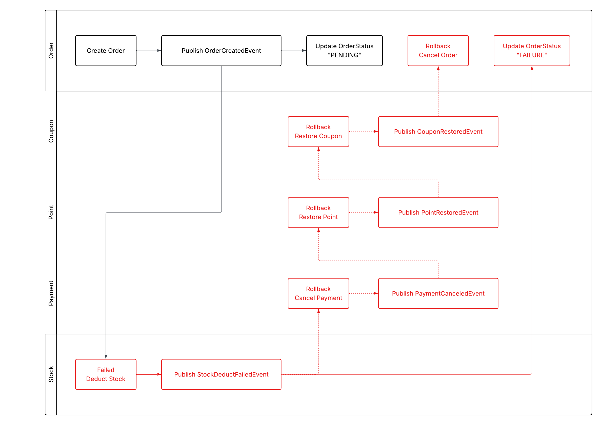

# 이제는 쪼갤 때다, 모놀리식에서 MSA로
## 🤔 왜 지금 MSA로 전환해야 할까?
우리 서비스는 점차 많은 사용자와 기능을 수용해야 하는 방향으로 성장하고 있으며, 이에 따라 시스템 구조의 유연성과 확장성이 점점 더 중요해지고 있습니다.

기존의 **모놀리식 아키텍처**는 모든 기능이 하나의 애플리케이션에 집약된 구조로, 다음과 같은 문제를 발생시켰습니다:

- 기능 하나의 수정이 전체 시스템의 **재배포**로 이어짐
- 특정 도메인의 트래픽 증가가 전체 시스템의 **병목 또는 장애**로 연결됨
- **팀 단위 병렬 개발**이 어렵고, 책임 분리가 불명확함
- 배포 속도, 장애 대응, 운영 효율성 모두에서 **유연성 부족**

서비스가 커질수록 이런 구조는 기술적 부채로 작용하며, 변화 대응력을 심각하게 떨어뜨립니다.  
이에 따라, 우리는 **도메인 단위의 마이크로서비스 아키텍처**로 전환하여 각 도메인을 독립적으로 배포·운영할 수 있는 구조로의 진화를 추진하게 되었습니다.

## 🔍 무엇이 문제였을까?
현재 서비스는 주요 도메인 로직들이 하나의 클래스 내부에 동기적으로 연결되어 있는 전형적인 ***절차 중심 구조***입니다.  
이는 초기 개발과 배포가 빠르다는 장점이 있지만, 시스템이 성장하고 복잡해질수록 다음과 같은 심각한 한계에 부딪히게 됩니다.  
다음은 기존 `주문_결제서비스`의 모습입니다:
```kotlin
class 주문_결제서비스{
    fun 주문_결제(){
        주문서생성()
        쿠폰사용()
        포인트차감()
        결제서생성()
        재고차감()
        외부데이터알림() // 부가로직
    }
}
```
이 구조는 다음과 같은 문제점을 갖고 있습니다:
- **높은 결합도**: 모든 로직이 직접 연결되어 있어 일부 기능 변경 시 전체 흐름에 영향
- **낮은 응집도**: 서로 다른 책임이 하나의 메서드에 뒤섞임
- **동기적 처리**: 모든 처리가 직렬로 이루어져 장애 전파, 성능 병목 발생
- **테스트/유지보수의 어려움**: 단위 테스트가 어렵고, 기능별 추적 및 관리가 힘듦

## 🪓 어떻게 쪼갤 것인가?
앞서 진단한 문제를 해결하기 위해 우리는 기존의 ***절차 중심 구조***를 **도메인 단위의 마이크로서비스 아키텍처**로 재구성하고, 서비스간 연결은 **Spring ApplicationEvent** 기반 이벤트 처리 방식으로 전환하려고 합니다.

> 💡 **Spring ApplicationEvent** 을 메시지 브러커로 사용하는 이유  
> 
> **Spring ApplicationEvent**는 외부 이벤트 브로커를 완전히 대체하지는 않지만, 단일 서비스 혹은 MSA 전환 과정의 중간 단계에서 매우 유용한 이벤트 버스 역할을 합니다.  
> 
> 추후 시스템이 성장하고 서비스 간 통신 복잡도가 증가하면 `Kafka` 등의 외부 이벤트 브로커로 전환하더라도, 현재의 이벤트 기반 설계는 그대로 활용 가능하다는 점에서 구조적 연속성도 확보할 수 있습니다.  

### 📦 도메인 분리 와 책임
- **`주문`**: 주문서 생성, 주문 상태 변경
- **`쿠폰`**: 쿠폰 사용/취소, 유효성 검증
- **`포인트`**: 포인트 차감/복구, 잔액 확인
- **`결제`**: 결제서 생성
- **`재고`**: 상품재고 차감/복구
- **`외부알림`**: 외부시스템 전송

### 📨 이벤트 흐름 설계
#### ✅ 정상 이벤트
- **주문서생성**: `OrderCreated`
- **쿠폰사용**: `CouponUsed`
- **포인트차감**: `PointUsed`
- **결제서생성**: `PaymentCreated`
- **재고차감**: `StockDeducted`

#### ❌ 실패 이벤트
- **주문서생성실패**: `OrderCreateFailed`
- **쿠폰사용실패**: `CouponUseFailed`
- **포인트차감실패**: `PointUseFailed`
- **결제서생성실패**: `PaymentCreateFailed`
- **재고차감실패**: `StockDeductFailed`

#### 🔄 보상 이벤트
- **결제취소완료**: `PaymentCancled`
- **포인트복원완료**: `PointRestored`
- **쿠폰복원완료**: `CouponRestored`
- **주문취소완료**: `OrderCancled`

#### ✅ 정상 흐름: 


#### ❌ 실패 및 보상 흐름: 


### 🏗️ EventListener 설계
각 도메인이 독립적으로 이벤트를 발행하고, 다른 도메인이 해당 이벤트를 수신하여 후속 작업을 수행하는 `Saga Choreography` 패턴을 기반으로 설계했습니다.
> 💡 `Saga Choreography` 패턴을 채택한 이유  
> 도메인별 서버 분리 및 서비스 독립 배포를 염두에 둔 구조적 기반을 마련하기 위함입니다.

이는 각 도메인이 스스로 이벤트를 발행하고, 필요한 이벤트를 수신하여 자체 로직을 실행하는 분산된 상태 전이 기반 설계 방식입니다.

설계 시 다음과 같은 원칙을 기준으로 도메인 리스너를 구현합니다:
#### 📌 설계 원칙
- 각 도메인은 **자신의 상태만 관리**하며, 다른 도메인의 상태를 추론하거나 직접 호출하지 않는다.
- 이벤트 기반으로 업무 로직을 전달하고, 다음 도메인의 행동을 간접적으로 유도한다.
- 실패 시에는 **보상 트랜잭션 이벤트를 별도로 발행**하여 상태 정합성을 회복한다.
- 이벤트 처리 시점은 이벤트의 성격과 목적에 따라 `@EventListener` 또는 `@TransactionalEventListener`로 구분한다.
> 💡 일반적으로 업무 흐름을 연결하는 이벤트는 `@EventListener`를 통해 트랜잭션 내에서 즉시 처리합니다.

> 💡 외부 호출이나 보상 트랜잭션 등 트랜잭션 커밋 이후 안전하게 처리되어야 하는 작업은 `@TransactionalEventListener`를 사용하여 실행 시점을 명시적으로 제어한다.

### 🚀 결론
이번 설계를 통해 기존의 단일 애플리케이션 구조에서 벗어나, 각 도메인이 자신의 책임과 상태를 관리하며 느슨하게 결합된 구조로 진화할 수 있는 기반을 마련하였습니다.  

`Spring ApplicationEvent`를 활용한 이벤트 기반 메시징과 `Saga Choreography` 패턴을 통해 서비스 간의 유연한 연결과 장애 격리, 보상 트랜잭션 흐름을 체계적으로 설계하였습니다.