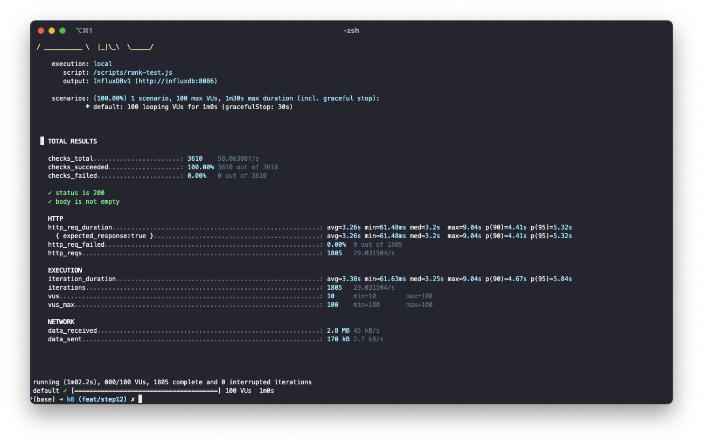
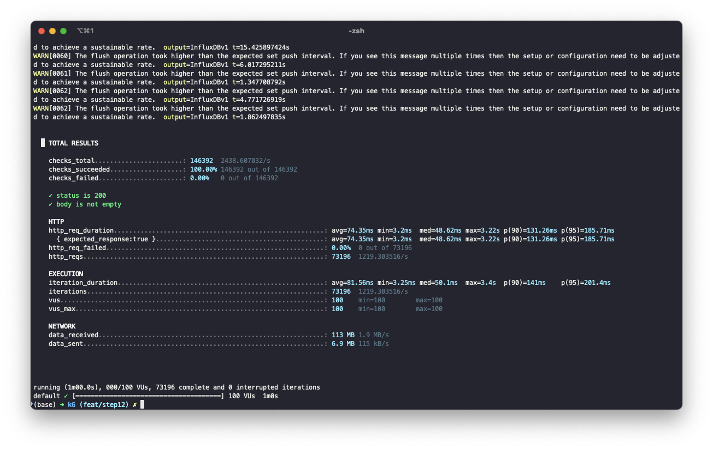

# 인기상품 조회 성능개선 보고서
### ☁️ 배경
인기상품 조회 API`/products/rank`는 전체 주문 데이터를 기반으로 인기 상품을 랭킹 형태로 제공하는 API입니다.<br>
해당 API는 일간 기준으로 인기상품을 집계하며, 총 상위 10개 상품의 인기상품을 제공합니다.<br>
초기 구현은 주문 실시간 집계하여 DB에서 직접 응답하는 방식으로 설계되어, 다량의 트래픽을 처리하기에 무리가 있는 상황이었습니다.

<br><br>

### ⚠️ 문제점
기존 /products/rank API는 호출 시마다 DB에서 GROUP BY + SUM + ORDER BY 연산을 수행하여 실시간 응답을 제공하였다.<br>
이는 트래픽이 증가할수록 데이터베이스 부하와 응답 시간이 선형적으로 증가하는 구조적 한계를 내포하고 있었습니다.<br>
```kotlin
@Query(
    """
    SELECT new kr.hhplus.be.server.domain.order.OrderProduct(o.productId as productId, p.name as productName, SUM(o.quantity) as totalOrder)
    FROM Order o JOIN Product p ON o.productId = p.productId
    GROUP BY o.productId, p.name
    ORDER BY SUM(o.quantity) DESC
    """
)
```
> 🚨 문제 현상 요약
- RDB 쿼리의 집계 연상 (`SUM`,`GROUP BY`)이 높은 부하 유발
- 트래픽 증가 시 응답 속도 급격히 저하
- DB CPU 사용률 비정상 상승

<br>

>  📌 초기 상태


- 평균 응답시간 (avg): 74.35ms
- 90 퍼센타일 (p90): 131.26ms
- 95 퍼센타일 (p95): 185.71ms
- **최대 응답시간 (max)**: **9.04s**
- 처리량 (req/sec): 1,219 req/s

<br><br>

### 🔍 접근
기존 방식은 DB 집계 연산이 요청마다 수행되기 때문에 응답 지연이 발생, 이에 따라 순위 데이터를 미리 계산하고 `redis-cache`로 응답하는 방식으로 구조를 변경하기로 결정하였다.<br>
`redis-cache` 도입으로 고정적인 순위결과를 `redis-cache`에 저장하여 반복되는 연산을 방지합니다.<br>
초기 인기순위 조회시 `redis-cache`를 확인, 데이터가 있으면 그대로 사용, 그렇지 않은 경우 `redis-cache`에 데이터를 넣습니다.<br>
| 항목     | Redis       | RDB (MySQL)     |
| ------ | ----------- | --------------- |
| 읽기 속도  | 매우 빠름       | 상대적으로 느림        |
| TTL 설정 | 가능          | 불가              |
| 확장성    | 수평 확장 용이    | 제한적             |
| 적합한 용도 | 캐시, 순위 집계 등 | 트랜잭션 정확도 필요한 업무 |

<br><br>

### 🚀 실행
성능 병목의 핵심이었던 `/products/rank`의 실시간 DB 연산을 제거하기 위해, 인기 상품 데이터를 미리 계산하여 Redis에 캐시하고, 이후 요청은 오직 캐시에서 조회하도록 시스템을 재설계했습니다. 이를 통해 DB 부하 없이 빠르고 안정적인 응답이 가능해졌습니다.

<br><br>

> 💡 캐싱되지 않은 상태에서 인기상품 조회 시 집계 캐싱
```kotlin
// service
@Cacheable(cacheNames = ["rank"], key = "'ALL'")
fun rank(): List<OrderInfo.OrderProductInfo> = OrderInfo
    .OrderProductInfo
    .ofList(orderRepository.getProductOrderStatsByQuantity())
```
```kotlin
// repository
 @Query(
    """
    SELECT new kr.hhplus.be.server.domain.order.OrderProduct(o.productId as productId, p.name as productName, SUM(o.quantity) as totalOrder)
    FROM Order o JOIN Product p ON o.productId = p.productId
    GROUP BY o.productId, p.name
    ORDER BY SUM(o.quantity) DESC
    """
)
fun getProductOrderStatsByQuantity(): List<OrderProduct>
```

<br><br>

### 📑 결과

| 항목                | DB 사용 시     | Redis 캐시 사용 시 | 개선율        |
| ----------------- | ----------- | ------------- | ---------- |
| 평균 응답시간 (avg)     | 74.35ms     | 3.26ms        | 🔽 95.6%  |
| 90 퍼센타일 (p90)     | 131.26ms    | 4.41ms        | 🔽 96.6%  |
| 95 퍼센타일 (p95)     | 185.71ms    | 5.32ms        | 🔽 97.1%  |
| **최대 응답시간 (max)** | **9.04s**   | **3.22s**     | 🔽 64.4%  |
| 처리량 (req/s)  | 1,219 req/s | 29,031 req/s  | 🔼 2282%  |

<br><br>

### 🤔 회고
이번 캐시 적용을 통해 순위 조회 API의 병목을 해소하고, 트래픽 증가에도 견딜 수 있는 안정성을 확보했다. 특히 Redis를 통한 캐싱 전략은 시스템의 실시간성과 성능을 모두 충족시켜, 다른 고집계 기반 API에도 동일한 방식의 도입 가능성을 제시하였다.<br>
다음 바로 고도화에 진행 예정인 기능은 `실시간 인기상품 조회`입니다. 해당 기능을 캐시의 계층분리도 고려해봐야할 것 같다.<br>
가령 `실시간` → `일간` → `주간` → `월간` → `연간` 이런식으로 캐시도 계층으로 나눠 관리가 된다면 `실시간` 데이터로 `일간` 데이터를 이 데이터로 `주간` ... 이렇게 확장해나가면 성능 개선에 도움이 될 것 같다.