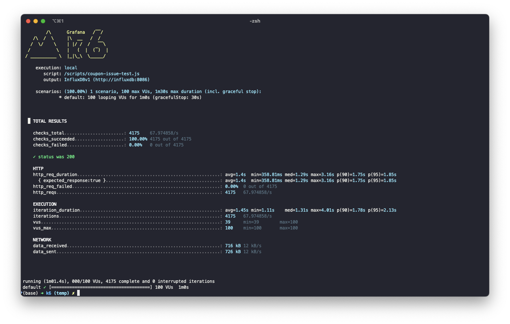
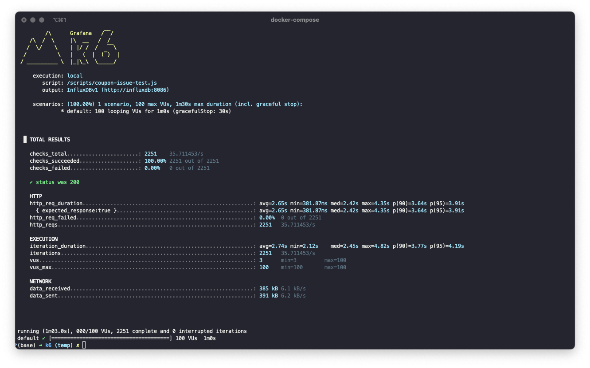

# 쿠폰발급 기능 분산락 적용 보고서
### 🎯 목적
쿠폰 발급 API /coupons/issue의 동시성 제어 방식을 비교하기 위해 DB Lock과 Redis 분산락을 각각 적용하여 성능과 실용성을 분석합니다. 
이를 통해 실서비스 환경에서 적절한 락 전략을 선택하는 데 참고가 될 수 있는 기준을 제시합니다.

  

### 📝 테스트 환경
| 항목              | 설정                     |
| --------------- | ---------------------- |
| 테스트 도구          | [k6](https://k6.io)    |
| 동시 접속 사용자 (VUs) | 100                    |
| 시나리오            | 쿠폰 1개에 100명이 동시에 발급 요청 |
| 테스트 기간          | 1분간 지속                 |

  

### 💡 구현방식

> ✅ DB Lock 방식

- 트랜잭션 내 SELECT ... FOR UPDATE 사용
- 발급 가능한 쿠폰인지 확인 후 수량 차감
- 동시 접근 시 DB 내부 락 큐에 의해 처리

> ✅ Redis 분산락 방식

- 쿠폰 ID 기반 락 키 사용: `lock:coupon:{couponId}`
- SET NX + TTL 조합으로 락 획득
- Pub/Sub 구성으로 진행
- TTL 설정을 통한 자동 만료

  

### 🔨 기술비교
| 항목          | DB Lock        | Redis 분산락                |
| ----------- | -------------- | ------------------------ |
| **속도**      | 트랜잭션 큐 대기 → 느림 | 메모리 기반 → 빠름              |
| **복잡도**     | 단순 쿼리 수준       | 락 해제, TTL, 재시도 로직 필요     |
| **스케일**     | DB 단일 인스턴스에 의존 | 수평 확장 용이 (Redis Cluster) |
| **안정성**     | ACID 보장        | 구현에 따라 정합성 이슈 가능         |
| **재시도 처리**  | DB 자동 큐잉       | 직접 구현 필요 (백오프 등)         |
| **락 자동 해제** | 불가 (트랜잭션 종료 시) | 가능 (TTL 만료)              |

  

### 📊 성능비교
> 🔐 DB Lock

> 🔐 Redis Lock

| 항목               | DB Lock       | Redis Lock     | 비교 (향상도 %)         |
|--------------------|---------------|----------------|--------------------------|
| 평균 응답 시간(ms) | 1400.00       | 2650.00         | 🔽 -89.29% (성능 저하)   |
| 90% 응답 시간(ms)  | 1750.00       | 3640.00         | 🔽 -108.00% (성능 저하)  |
| 95% 응답 시간(ms)  | 1850.00       | 3910.00         | 🔽 -111.35% (성능 저하)  |
| 최대 응답 시간(ms) | 3160.00       | 4350.00         | 🔽 -37.65% (성능 저하)   |
| 처리량 (req/s)     | 67.97         | 35.71           | 🔽 -47.47% (처리량 감소) |

> ✅ 기대했던 분산락의 장점
- 서비스 간 락 공유 가능 (분산 환경에서 유리)
- DB에 락 부하를 주지 않아 DB 부하 분산
- TTL 기반 자동 해제로 데드락 회피 가능

> ❌ 테스트 결과에서의 한계 - Redis Lock은 다음과 같은 이유로 성능이 더 나빴음
- 네트워크 왕복(RTT)이 추가됨
- Redis 연산 오버헤드 (SETNX, EXPIRE, DEL)
- 락 획득 실패 후 재시도 로직으로 인해 지연 증가
- 락 TTL 내에서만 처리가 되어야 하는 시간 제한 부담

  

### 🤔 결론
분산락은 단일 서버 이상의 환경, 혹은 DB 락 충돌이 심한 시스템에서 유리할 수 있으나, 모든 상황에서 성능이 더 뛰어난 것은 아니다. 
단일 인스턴스 환경 또는 락 경합이 심하지 않은 경우에는 DB 락이 오히려 더 효율적이라는 결과가 나왔습니다. 
분산락은 상황에 따라 추가적인 복잡도와 성능 저하를 유발할 수 있음을 확인했습니다. 
락 적용 전략은 트래픽 특성, 인프라 구조, 응답 시간 민감도 등을 함께 고려하여 결정해야 한다는 결론입니다. 