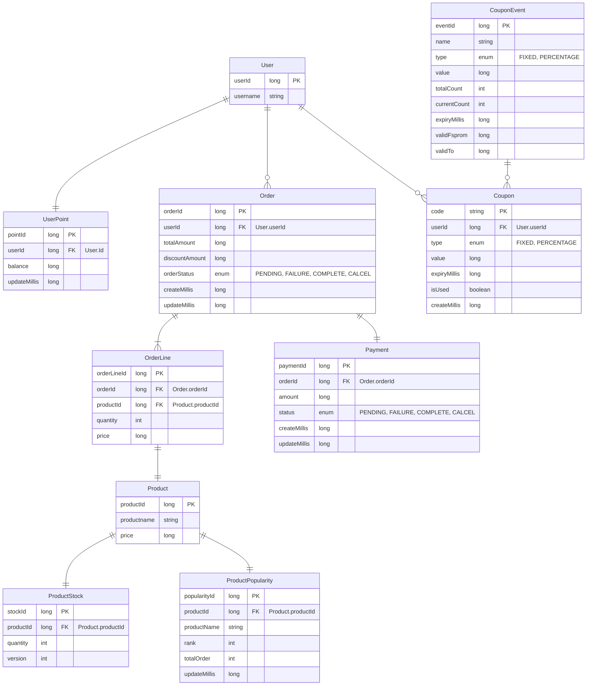
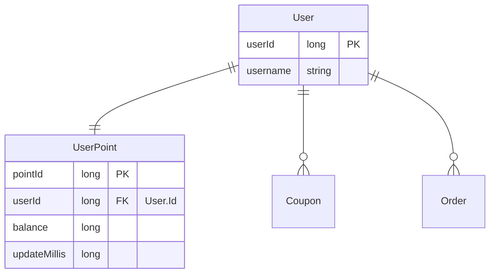
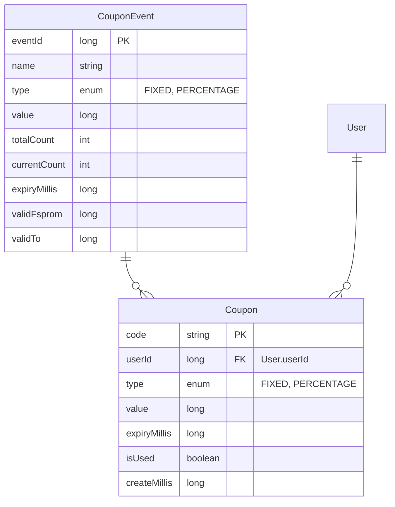
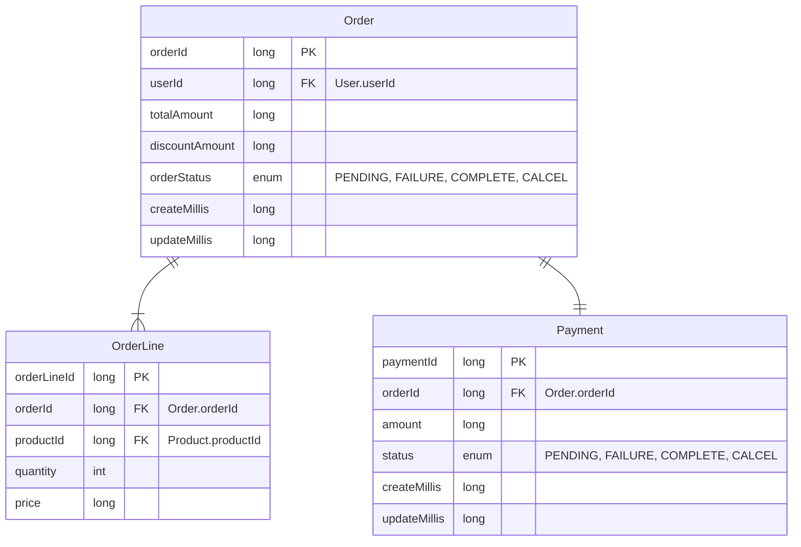
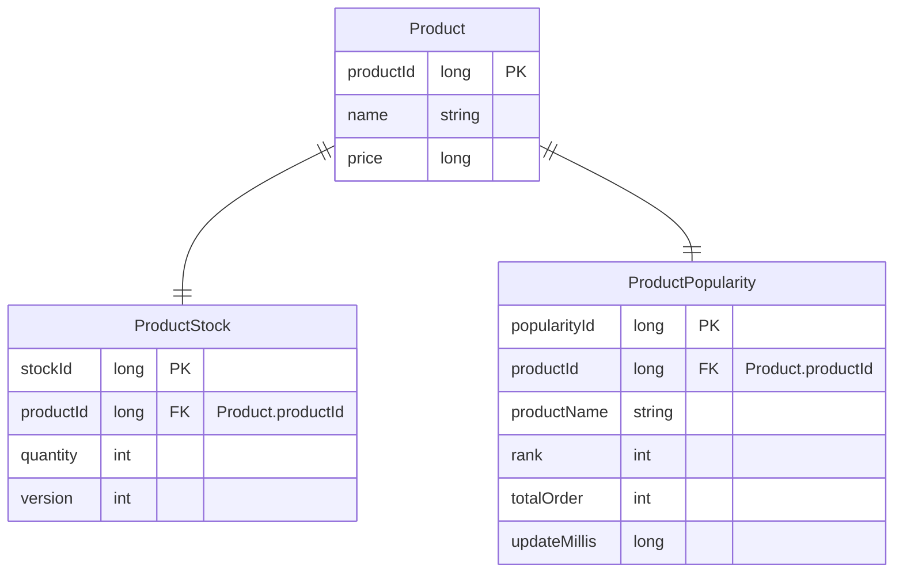

# ERD
- [Total](#total)
- [User](#user)
- [UserPoint](#userpoint)
- [Order](#order)
- [OrderLine](#orderline)
- [Payment](#payment)
- [CouponEvent](#CouponEvent)
- [Coupon](#coupon)
- [Product](#product)
- [ProductStock](#productstock)
- [ProductPopularity](#productpopularity)

 

## Total

 

## User

### `User`
**Properties**
- `userId`: 유저아이디 `PK`
- `username`: 유저명

### `UserPoint`
**Properties**
- `pointId`: 포인트 아이디 `PK`
- `userId`: [User.userId](#user) `FK`
- `balance`: 잔액
- `updateMillis`: 수정일시

 

## Evnets

### `CouponEvent`
**Properties**
- `eventId`: 이벤트아이디 `PK`
- `name`: 이벤트명
- `type`: 할인정책  "FIXED, PERCENTAGE"
    > - `FIXED`: 정액 
    > - `PERCENTAGE`: 정률
- `value`: 할인금액
- `totalCount`: 전체개수
- `currentCount`: 발급개수
- `expiryDate`: 만료일자
- `validFrom`: 발급시작일자
- `validTo`: 발급종료일자

### `Coupon`
**Properties**
- `code`: 코드번호 `PK`
- `userId`: [User.userId](#user) `FK`
- `type`: 할인정책  "FIXED, PERCENTAGE"
    > - `FIXED`: 정액 
    > - `PERCENTAGE`: 정률
- `value`: 할인금액
- `expiryDate`: 만료일자
- `isUsed`: 사용상태
- `createMillis`: 생성일시

 

## Orders

### `Order`
**Properties**
- `orderId`: 오더아이디 `PK`
- `userId`: [User.userId](#user) `FK`
- `totalAmount`: 전체가격
- `discountAmount`: 할인금액
- `orderStatus`: 주문상태
    > - `PENDING`: 결제대기 
    > - `FAILURE`: 주문실패
    > - `COMPLETE`: 주문완료
    > - `CALCEL`: 주문취소
- `createMillis`: 생성일시
- `updateMillis`: 수정일시

### `OrderLine`
**Properties**
- `orderLineId`: 오더라인아이디 `PK`
- `orderId`: [Order.orderId](#order) `FK`
- `productId`: [Product.productId](#product) `FK`
- `quantity`: 개수
- `price`: 단가

### `Payment`
**Properties**
- `paymentId`: 결제아이디 `PK`
- `orderId`: [Order.orderId](#order) `FK`
- `amount`: 결제금액
- `status`: 상태
    > - `PENDING`: 결제중 
    > - `FAILURE`: 결재실패
    > - `COMPLETE`: 결재완료
- `createMillis`: 생성일시
- `updateMillis`: 수정일시

 

## Products

### `Product`
**Properties**
- `productId`: 상품아이디 `PK`
- `name`: 제품명
- `price`: 단가

### `ProductStock`
**Properties**
- `stockId`: 재고아이디 `PK`
- `productId`: [Product.productId](#product) `FK`
- `quantity`: 재고량
- `version`: 버전

### `ProductPopularity`
**Properties**
- `popularityId`: 상위상품아이디 `PK`
- `productId`: [Product.productId](#product) `FK`
- `productName`: 상품명
- `rank`: 순위
- `totalOrder`: 총주문개수
- `updateMillis`: 수정일시