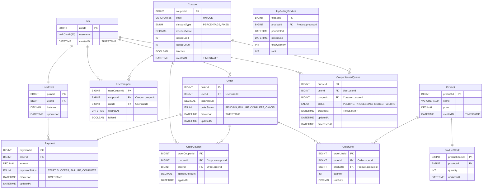

# ERD
- [Total](#total)
- [User](#user)
- [UserPoint](#userpoint)
- [Order](#order)
- [OrderLine](#orderline)
- [Product](#product)
- [ProductStock](#productstock)
- [Coupon](#coupon)
- [UserCoupon](#usercoupon)
- [OrderCoupon](#ordercoupon)
- [Payment](#payment)
- [CouponIssuedQueue](#couponissuedqueue)
- [TopSellingProduct](#topsellingproduct)

 

## Total

 

## Orders

### `User`
**Properties**
- `userId`: 유저아이디 `PK`
- `username`: 유저명
- `createdAt`: 생성일시

### `UserPoint`
**Properties**
- `pointId`: 포인트 아이디 `PK`
- `userId`: [User.userId](#user) `FK`
- `balance`: 잔액
- `updatedAt`: 수정일시

### `Coupon`
**Properties**
- `couponId`: 쿠폰아이디 `PK`
- `code`: 코드번호 `UNIQUE`
- `discountType`: 할인형태
    > - `PERCENTAGE`: 퍼센트금액
    > - `FIXED`: 고정금액
- `discountValue`: 할인금액
- `issuedLimit`: 발급제한개수
- `issuedCount`: 발급개수
- `isActive`: 활성화상태
- `createdAt`: 생성일시

### `UserCoupon`
**Properties**
- `userCouponId`: 유저쿠폰아이디 `PK`
- `couponId`: [Coupon.couponId](#coupon) `FK`
- `userId`: [User.userId](#user) `FK`
- `expiresAt`: 만료일시
- `isUsed`: 사용여부

### `OrderCoupon`
**Properties**
- `orderCouponId`: 오더쿠폰아이디 `PK`
- `couponId`: [Coupon.couponId](#coupon) `FK`
- `orderId`: [Order.orderId](#order) `FK` 
- `appliedDiscount`: 할인적용금액
- `appliedAt`: 할인적용일시

### `Order`
**Properties**
- `orderId`: 오더아이디 `PK`
- `userId`: [User.userId](#user) `FK`
- `totalAmount`: 전체가격
- `orderStatus`: 주문상태
    > - `PENDING`: 결제대기 
    > - `FAILURE`: 주문실패
    > - `COMPLETE`: 주문완료
    > - `CALCEL`: 주문취소
- `createdAt`: 생성일시
- `updatedAt`: 수정일시

### `OrderLine`
**Properties**
- `orderLineId`: 오더라인아이디 `PK`
- `orderId`: [Order.orderId](#order) `FK`
- `productId`: [Product.productId](#product) `FK`
- `quantity`: 개수
- `unitPrics`: 단가

 

## Products

### `Product`
**Properties**
- `productId`: 상품아이디 `PK`
- `name`: 제품명
- `price`: 단가
- `createdAt`: 생성일시

### `ProductStock`
**Properties**
- `productStockId`: 재고아이디 `PK`
- `productId`: [Product.productId](#product) `FK`
- `quantity`: 재고량
- `updatedAt`: 수정일시

 

## Queue

### `CouponIssuedQueue`
**Properties**
- `queueId`: 큐아이디 `PK`
- `userId`: [User.userId](#user) `FK` 
- `couponId` [Coupon.couponId](#coupon) `FK`
- `status`: 
    > - `PENDING`: 발급대기중
    > - `PROCESSING`: 발급중
    > - `ISSUED`: 발급완료
    > - `FAILURE`: 발급실패
- `createdAt`: 생성일시 `TIMESTAMP`
- `updatedAt`: 수정일시
- `processedAt`: 발급시작일시

## Aggregation

### `TopSellingProduct`
**Properties**
- `topSellId`: 상위판매아이디 `PK`
- `productId`: [Product.productId](#product) `FK` 
- `periodStart`: 집계시작시간
- `periodEnd`: 집계완료시간
- `totalQuantity`: 총판매량
- `rank`: 순위