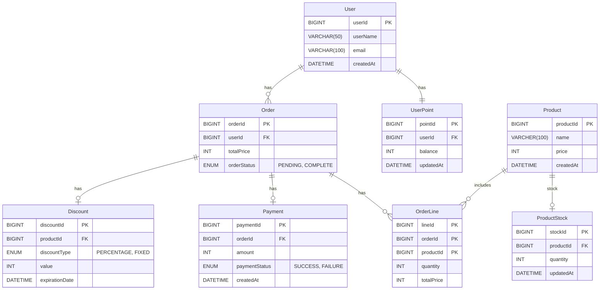
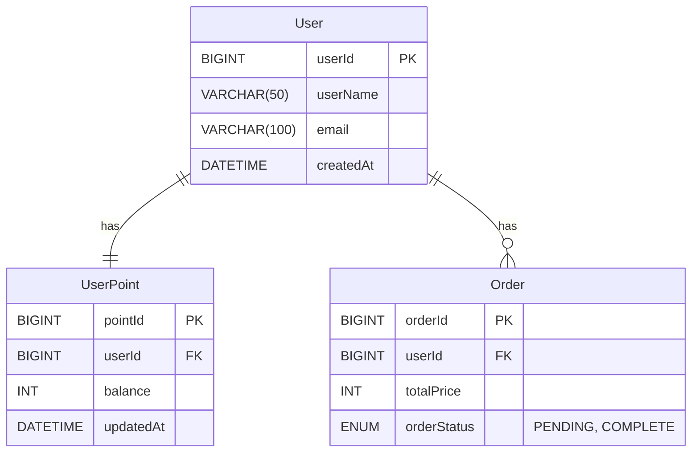
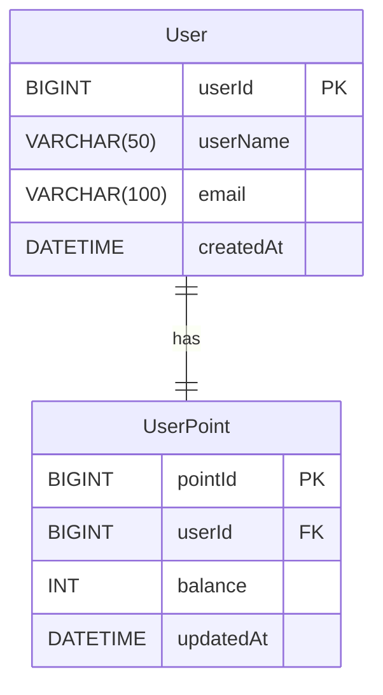
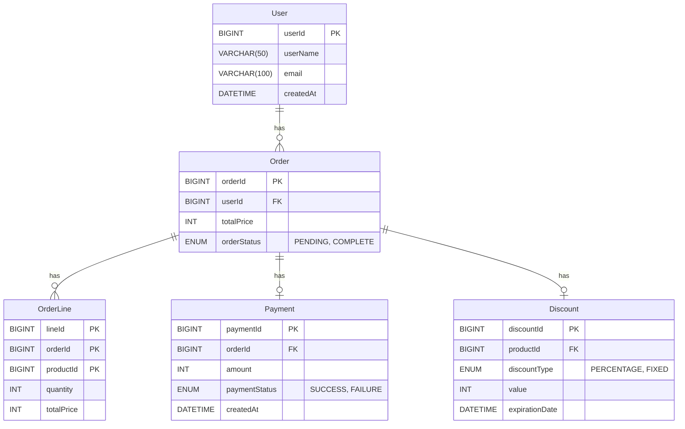
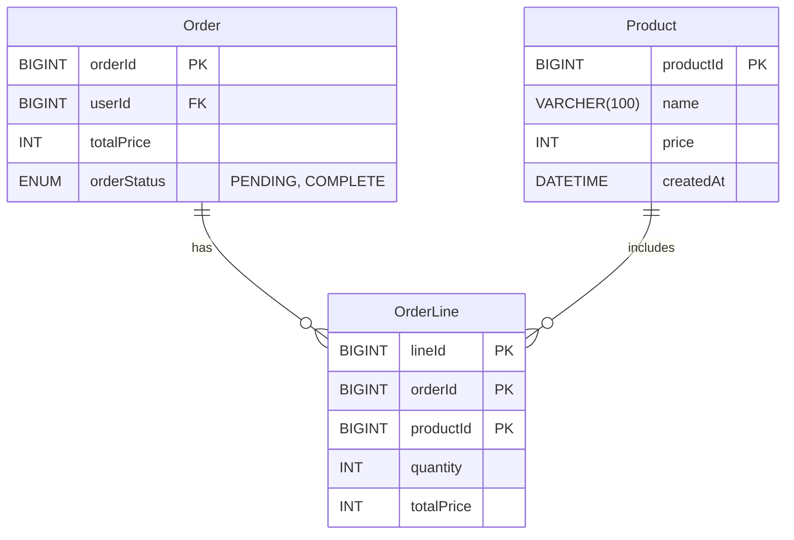
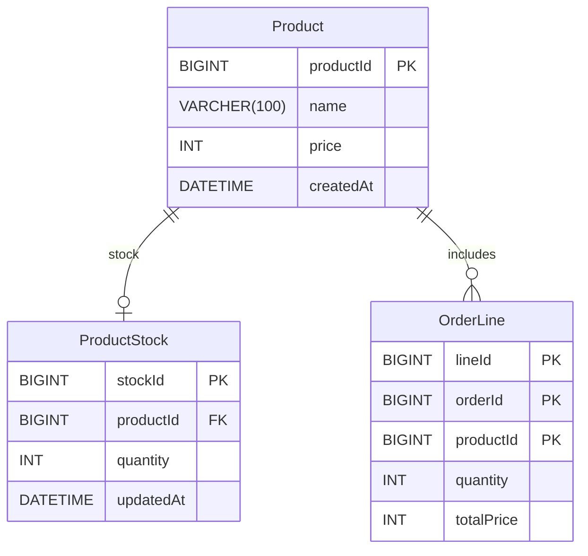
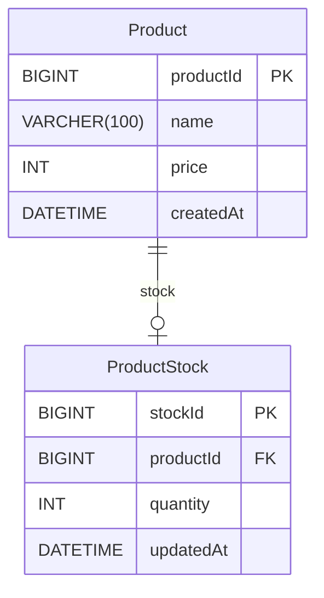
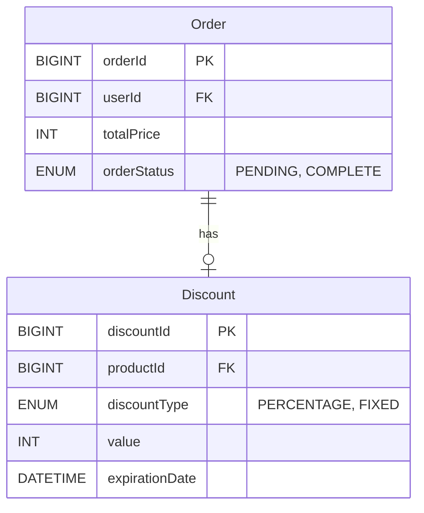

# ERD
- [Total](#total)
- [User](#user)
- [UserPoint](#userpoint)
- [Order](#order)
- [OrderLine](#orderline)
- [Product](#product)
- [ProductOption](#productoption)
- [ProductStock](#productstock)
- [Discount](#discount)

 

### Total

### User

**Properties**
- `userId`: PK - 사용자 아이디
- `userName`: 사용자명
- `email`: 이메일
- `createdAt`: 생성일자

 

### UserPoint

**Properties**
- `pointId`: PK - 포인트 아이디
- `userId`: FK - User.userId
- `balance`: 잔액
- `updatedAt`: 업데이트 일자

 

### Order

**Properties**
- `orderId`: PK - 오더아이디
- `userId`: FK - User.userId
- `totalPrice`: 전체가격
- `orderStatus`: 주문상태

 

### OrderLine

**Properties**
- `lineId`: PK - 라인아이디
- `orderId`: FK - Order.orderId
- `productId`: FK - Product.productId
- `quantity`: 양
- `totalPrice`: 초가격

 

### Product

**Properties**
- `productId`: PK - 상품아이디 
- `name`: 제품명
- `price`: 단가
- `createdat`: 생성일자

 

### ProductStock

**Properties**
- `stockId`: PK - 재고아이디
- `productId`: FK - Product.productId
- `quantity`: 양
- `updatedAt`: 업데이트일자

 

### Discount

**Properties**
- `discountId`: PK - 할인아이디
- `productId`: FK - Product.productId
- `discountType`
- `value`: 할인 값
- `expirationDate`: 유효기간