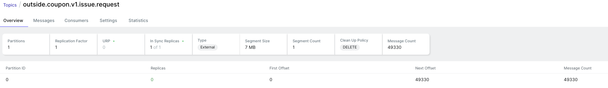

# 부하 테스트 결과 보고서
## 📌 개요
- 목적: 이벤트 트래픽 상황에서 `POST /coupon/issue` API 및 발급 처리 흐름의 성능, 안정성, 병목 여부를 검증
- 방법: `k6`를 활용한 `Peak Test` 시나리오 실행
- 시스템 자원: `4 CPU`, `4GB RAM`, `G1GC`

## 🚙 테스트 시나리오
- 시나리오: `Peak Load Test`
- Virtual Users (VU): `최대 500명`
- 요청 방식: `1초당 1건 요청`
- 요청 총량: `약 49,330건`
```javascript
stages: [
  { duration: '1m', target: 10 },
  { duration: '30s', target: 100 },
  { duration: '2m', target: 500 },
  { duration: '30s', target: 100 },
  { duration: '1m', target: 0 },
]
```

## 📈 주용 성능 지표

|항복 |측정값 |목표치 |평가|
|---|---|---|---|
|요청수|49,330건|-|✅|
|평균 TPS|164 TPS|≥ 400 TPS|⚠️ 미달|
|P90 |23.74ms|≤ 1000ms|✅|
|P95|51ms|≤ 1000ms|✅|
|최대 응답 시간|944ms|≤ 2000ms|✅|
|실패율|0.00%|< 5%|✅|
> 💡 API 자체는 매우 안정적으로 처리되었으나, TPS는 목표에 도달하지 못함

## 📨 kafka 발급 요청 메시지 처리

|항목|값|평가|
|---|---|---|
|Kafka 발행 메시지 수|49,330건|✅|
|Topic|outside.coupon.v1.issue.request|
|Partition 수|1|⚠️ 병렬 처리 제한 가능성|
|Kafka Lag|없음 확인 (실시간 소진)|✅|
> 💡 Kafka Producer는 전송 정상, Consumer 병목 가능성 있음

## 📩 쿠폰 발급 처리 결과

|항목|목표|결과|평가|
|---|---|---|---|
|**발급 처리 TPS**|≥ 350 TPS|⚠️ 미확인|⚠️ 불확실|
|**발급 성공률**|100%|20.13%|⚠️ 불확실|
> 💡 **발급 성공률 20%**는 중복 차단, 조건 제한 등 비즈니스 로직에 의한 것으로 보임 → 기술적 실패는 아닌 것으로 예상

## ⚙️ 시스템 자원 사용


|항목|상태|평가|
|---|---|---|
|JVM Heap 사용률 |평균 34%, 최대 46%        |✅|
|GC Pause     |평균 20\~80ms, 최대 120ms |✅|
|Thread 수     |최대 256개               |⚠️ 높음|
|CPU 사용률      |최대 34%                |✅|
> 💡 GC, 메모리 안정적. 리소스 부족 없음

## 📝 결론
|항목|평가 |설명|
|---|---|---|
|요청 처리 품질 |✅  |응답 속도, 안정성 모두 우수|
|TPS 성능|⚠️ |목표치 대비 낮음 (164 < 400)|
|처리 병목|⚠️ |Kafka Partition = 1로 병렬성 제한|
|발급 결과|⚠️ |제한 수량 도달 이후 모두 차단됨|

## 🤔 개선 방안
|항목|개선 방안|
|---|---|
|**Kafka 병렬성 개선**|Topic Partition 수 `1 → 3~5`, Consumer group 분산 처리|
|**TPS 향상 시나리오 재설계**|`max_count` 1000 이상으로 테스트 재실행|
|**비동기 처리 TPS 시각화**|Micrometer / Prometheus에 `발급 처리 카운터` 연동|
|**Thread Pool 튜닝**|`@KafkaListener`나 `Executor` 사용 시 core/thread 확인|