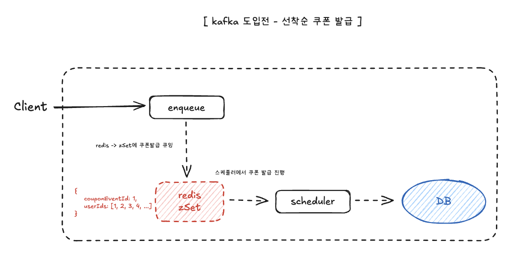
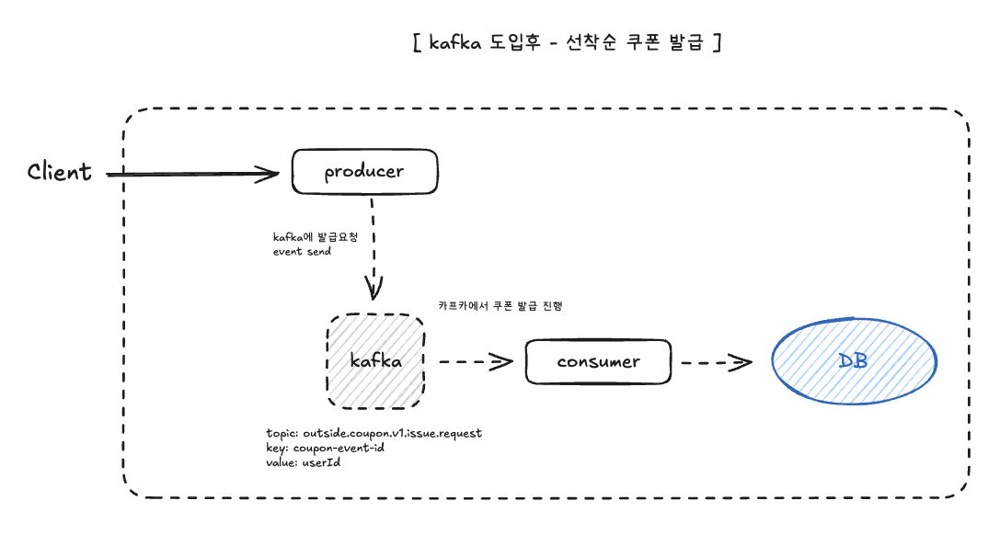

# 선착순 쿠폰 발급 고도화 redis -> kafka 전환
## 🔴 현재의 선착순 쿠폰 
### Redis zSet + Scheduler 구조

쿠폰발급요청이 들어오면 `redis`에 `zSet`으로 저장 후 `스케줄러`를 이용 쿠폰을 발급한다.
### 장점
- 단순한 구조
- 구현 용이
- 빠른 큐잉
### 단점
- redis 장애 시 데이터 손실 위험

## 🟢 변경된 선착순 쿠폰 발급
### kakfa event 기반

쿠폰발급요청이 들어오면 `kafka`에 `쿠폰발급요청됨 이벤트` 발행, 이후 `컨슈머`를 통해 쿠폰을 발급힌다.
### 장점
- 장애 복구 용이 → 메시지 유실 위험이 낮음
- 확장성에서 유리함
### 단점
- 초기 도입/운영 비용
- 운영 난이도 증가(운영 자동화/모니터링/알림 체계 필요)

## 💡 kafka 구조 도입 효과
- 데이터 유실 위험성 최소화, 장애 기 빠른 복구 → 운영 신뢰성 증가
- 다양한 이벤트 기반 프로세스와 연계 가능 → 업무 확장성 증가

## 🚀 향후 고려/고도화 방안
- 장애 시 DLQ 등 추가 처리 고려
- kafka/consumer 모니터링
