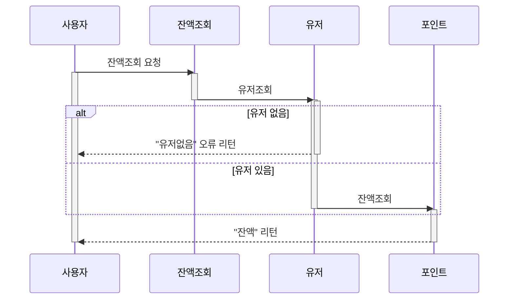
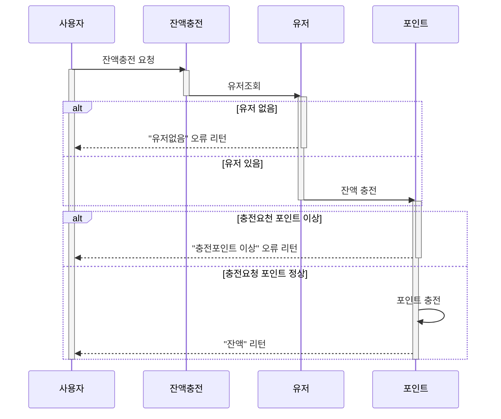
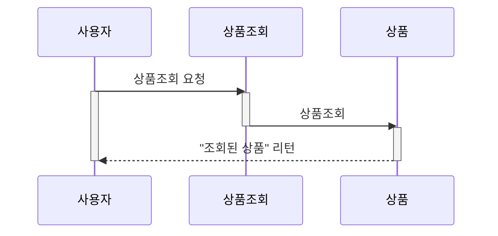
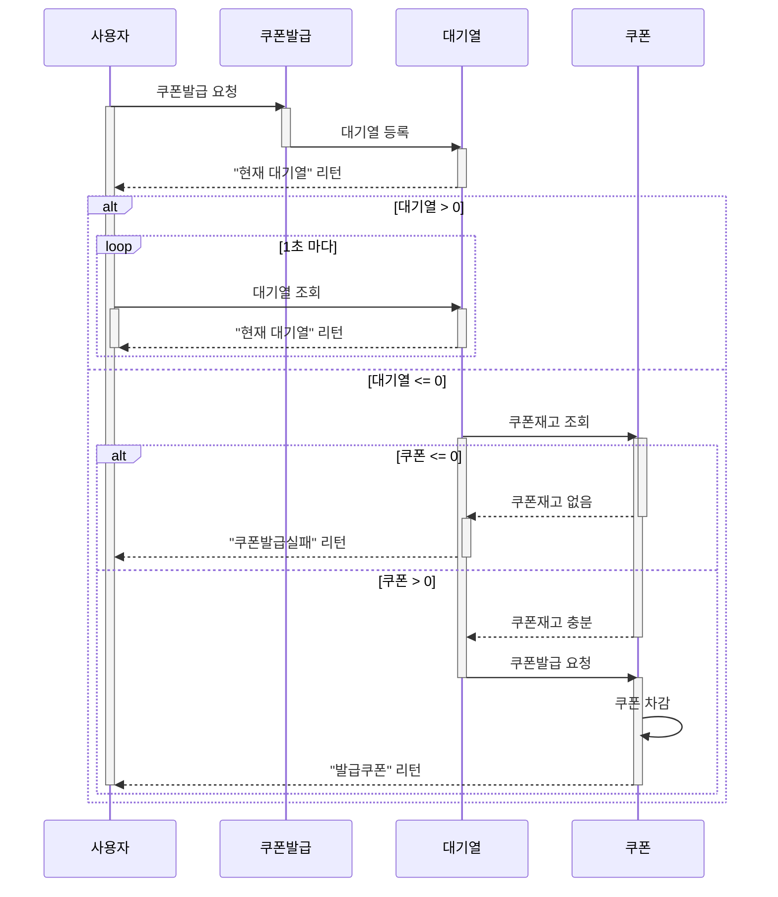
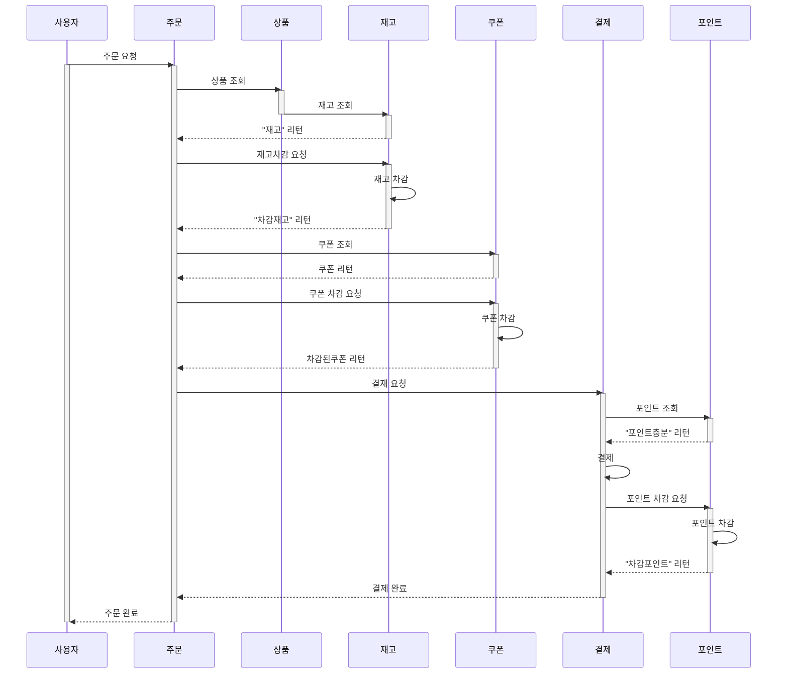
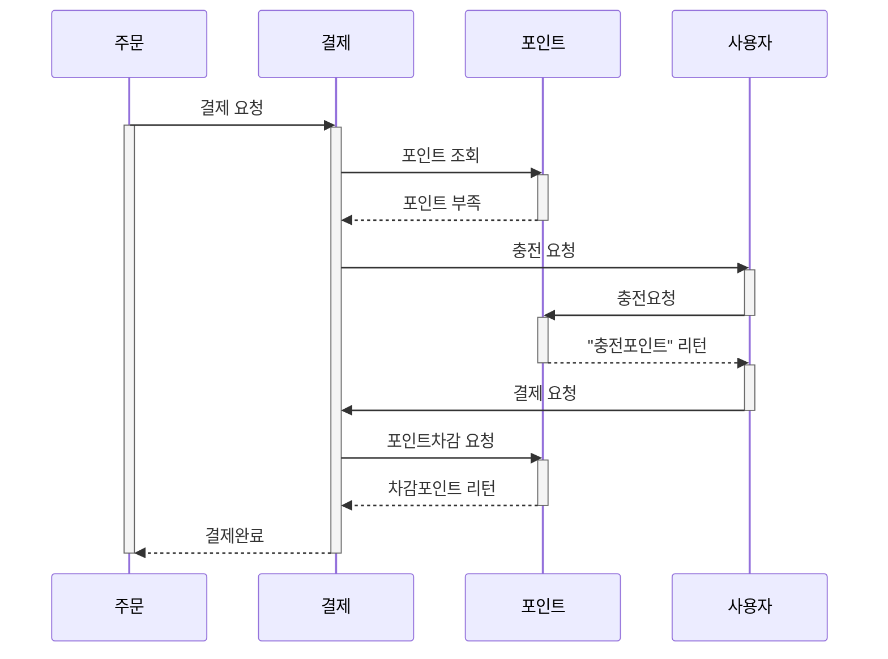
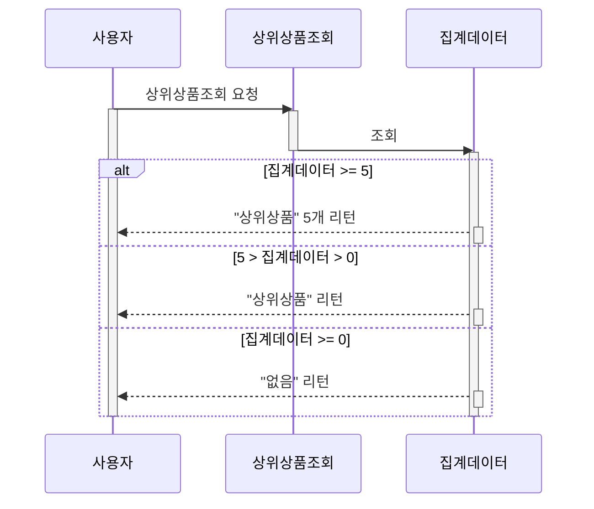

# 시퀀스 다이어그램

### 시나리오
- 잔액조회
- 잔액충전
- 상품조회
- 선착순 쿠폰발급
- 주문/결제
- 상위 상품 조회

 

### 잔액조회

 

### 잔액충전

 

### 상품조회

 

### 선착순 쿠폰발급

 

### 주문/결제
주문/결제

`포인트 부족` → `포인트 충전` → 결제

 

### 상위 상품 조회
