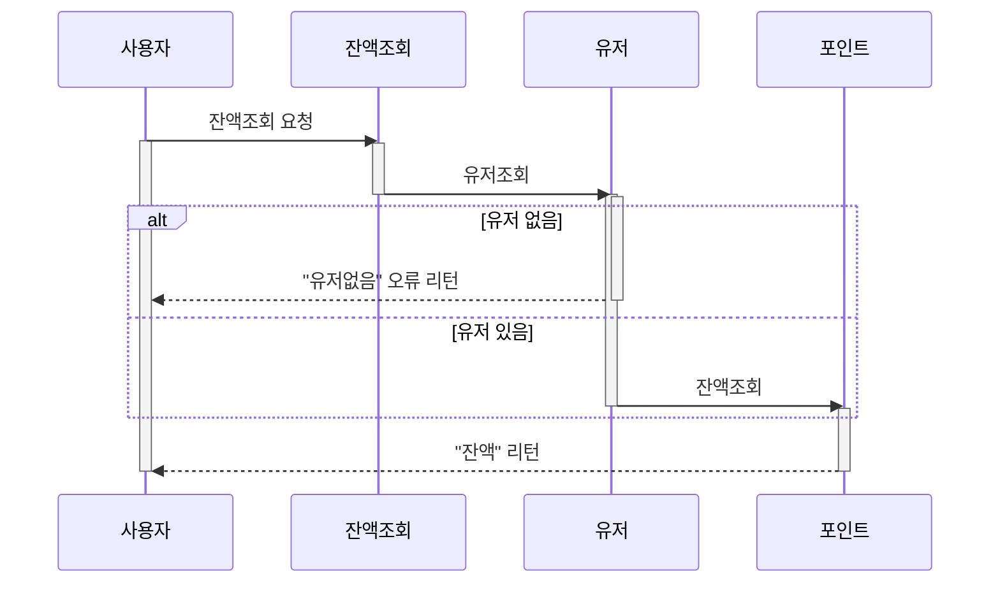
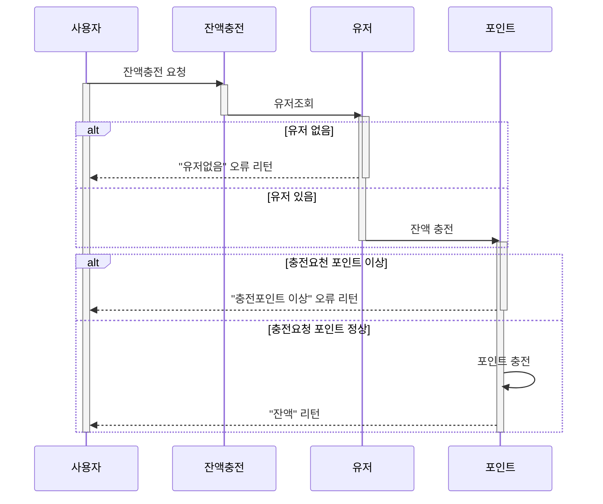
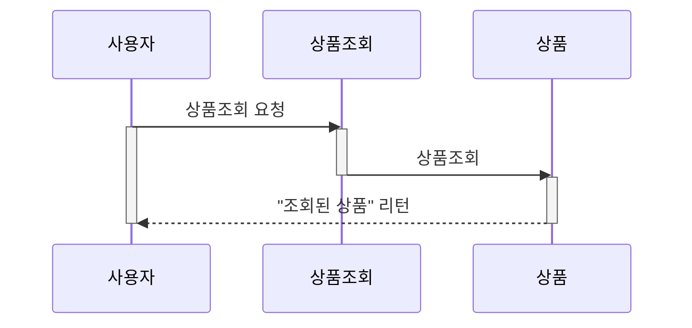
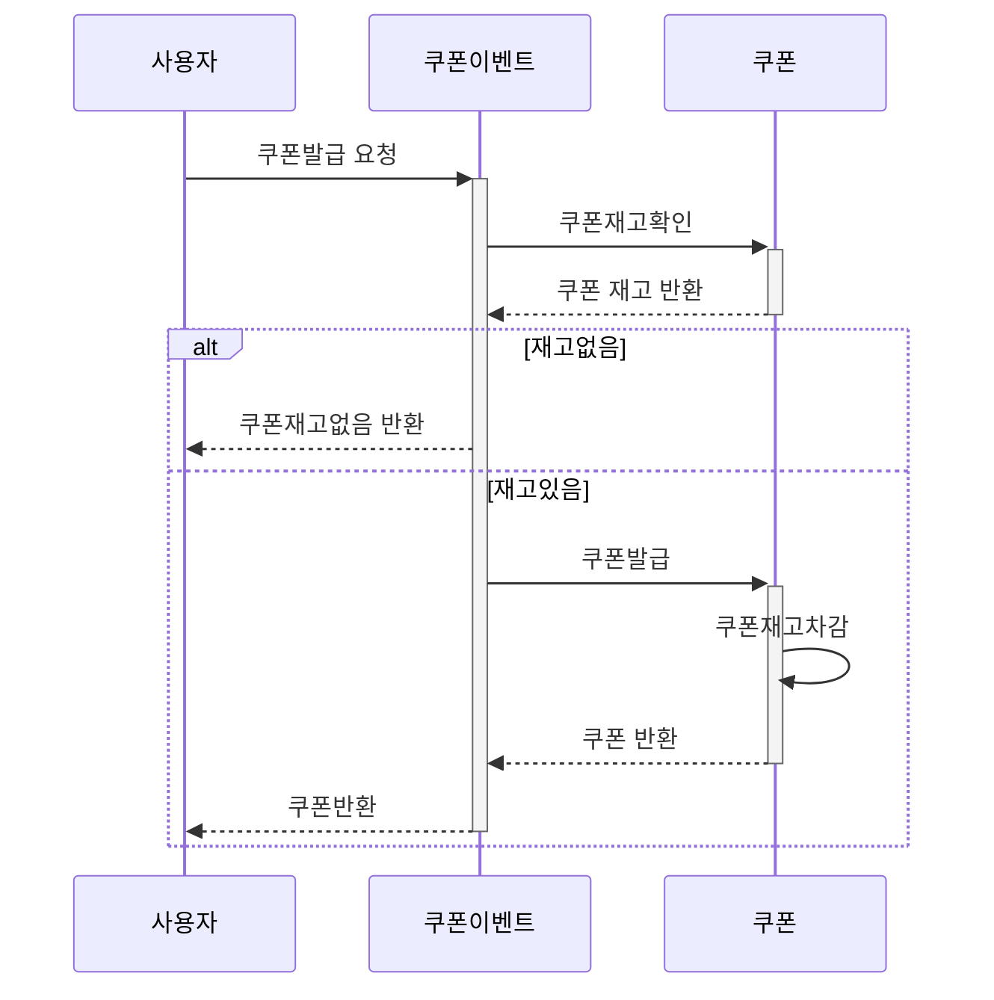
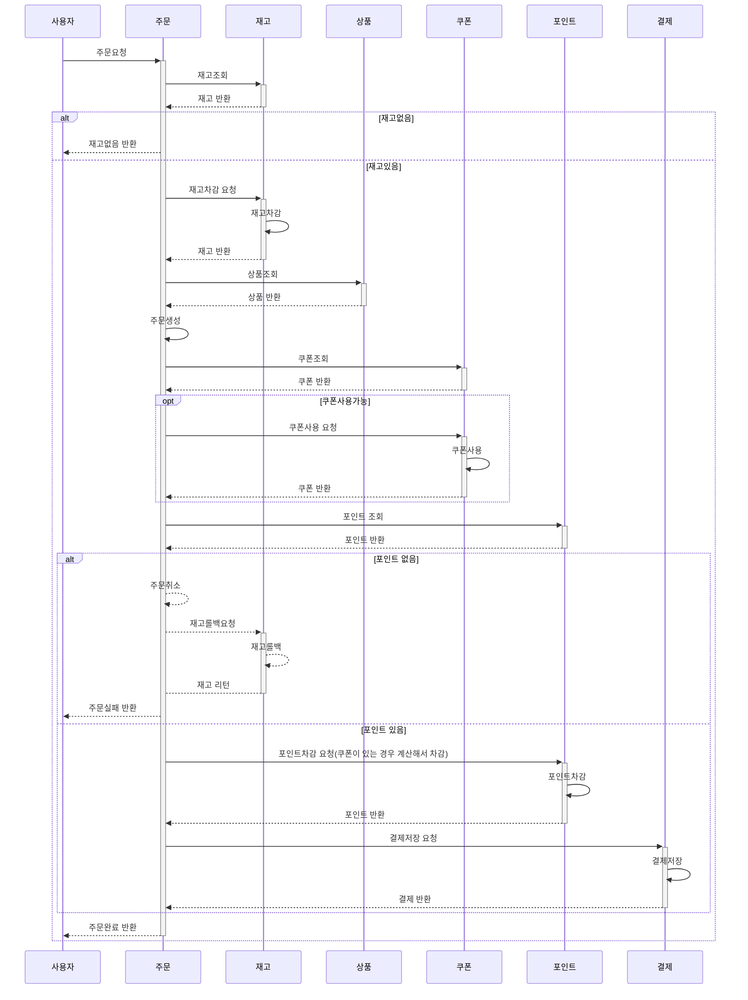
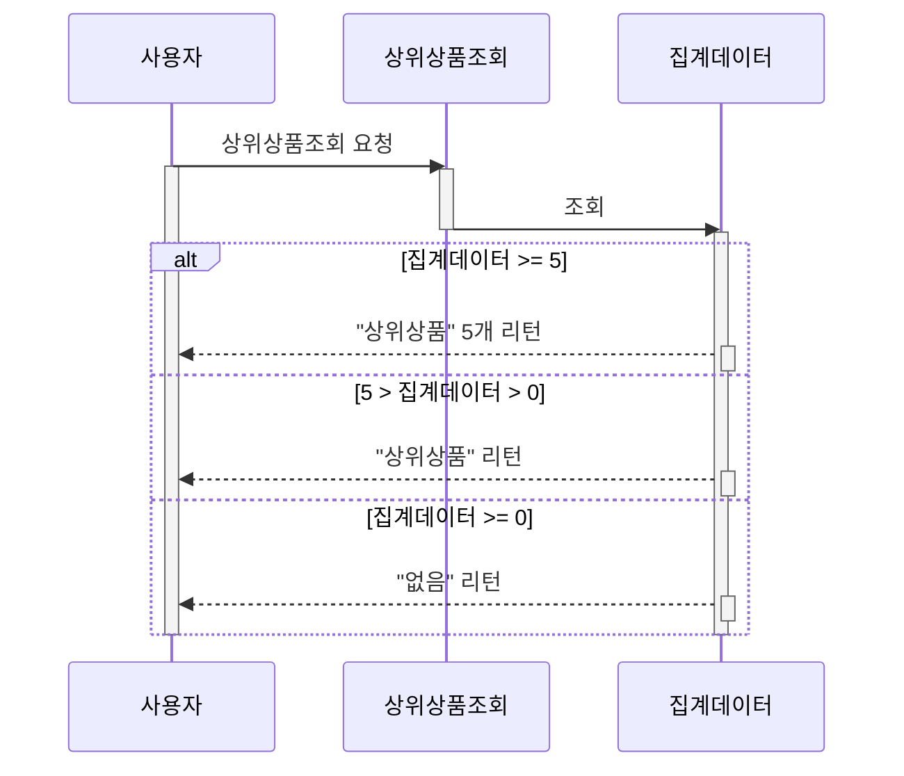

# 시퀀스 다이어그램

## 도메인
- [잔액조회](#잔액조회)
- [잔액충전](#잔액충전)
- [상품조회](#상품조회)
- [선착순 쿠폰발급](#선착순-쿠폰발급)
- [주문/결제](#주문결제)
- [상위 상품 조회](#상위-상품-조회)

 

### 잔액조회

 

### 잔액충전

 

### 상품조회

 

### 선착순 쿠폰발급

 

### 주문/결제
주문/결제

 

### 상위 상품 조회
