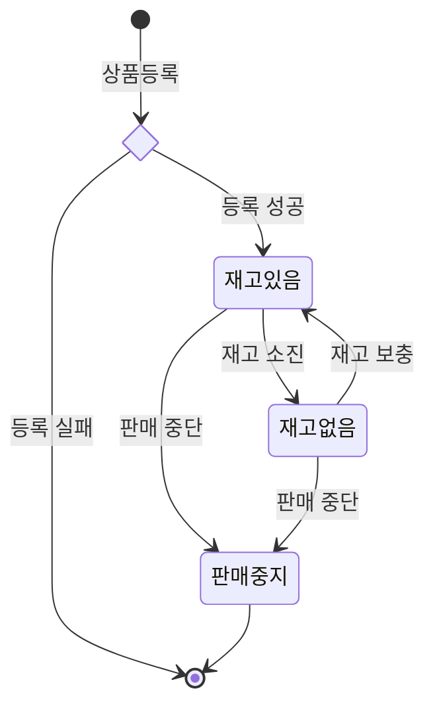
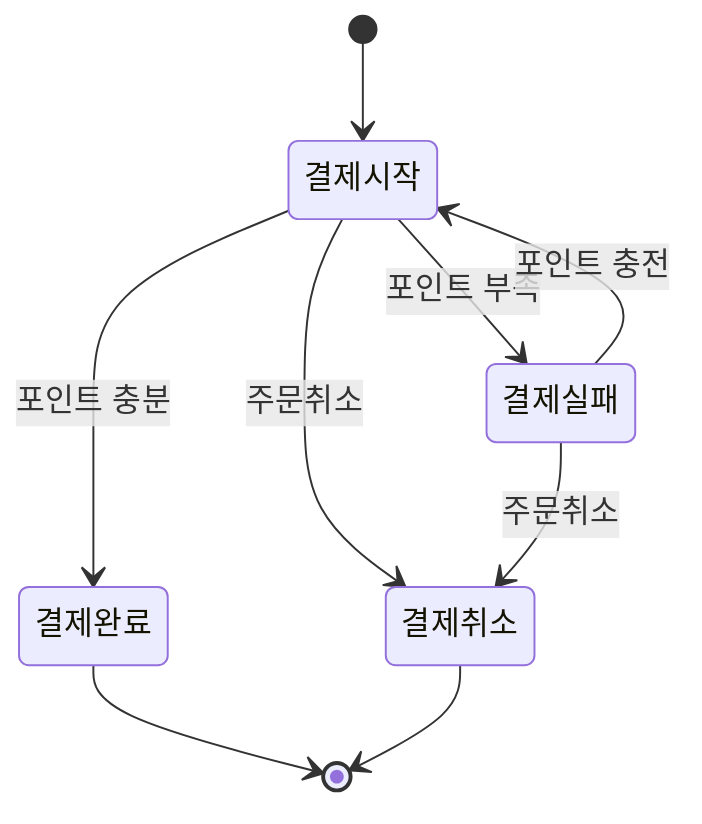
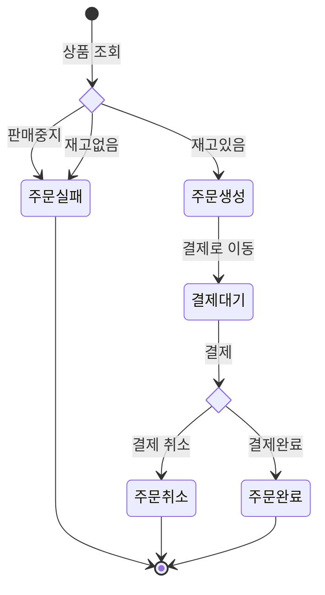
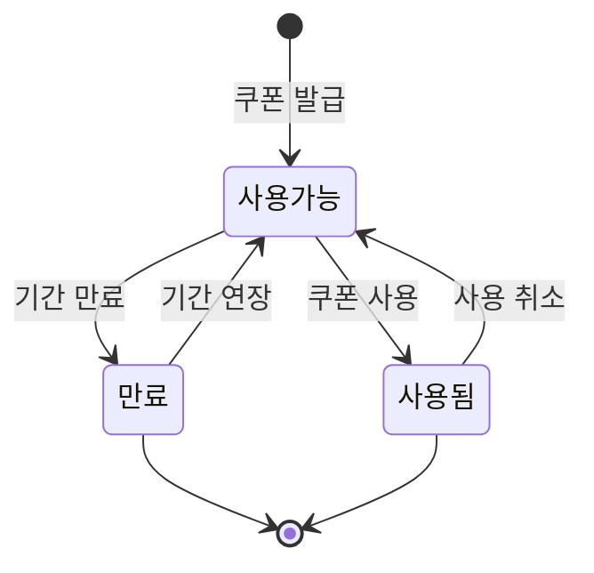

# 상태 다이어그램
> 💡 `상태 다이어그램`은 `도메인의 생명주기`를 나타낸다. 
> `도메인 변경`은 `도메인의 생명주기`에서만 발생한다.

### ✍️ 고려해야하는 상태
- 상품상태
- 결제상태
- 주문상태
- 쿠폰상태

 

### 🎁 상품상태

> 💡 `상품상태`는 `주문`에 영향을 받는다. 
> `판매중단`을 했을 경우 `재고없음` 상태로 돌아가면 이상함으로 `판매중지` 상태를 따로 두었다.
- `재고있음`: `주문` → O 
- `재고없음`: `주문` → X
- `판매중지`: `주문` → X

 

### 🧮 결제상태

> 💡 `결재상태`는 `주문`,`포인트`에 영향을 받는다. 
> `결제실패` 상태는 `포인트 충전`을 진행 
> `결제금액` >= `포인트잔액` 을 만족한다면 `결제시작`으로 다시 돌아간다. 
> `결제금액` < `포인트잔액` 이라면 다시 `포인트 충전`을 진행할지 선택한다.
- `결재시작`: `주문` → 결제대기중
- `결재실패`: `포인트` → `포인트잔액` < `결제금액`
- `결제완료`: `포인트` → `포인트잔액` >= `결제금액`
- `결제취소`: `주문` →  취소

 

### 🧾 주문상태

> 💡 `주문상태`는 `상품상태`, `결제상태`에 영향을 받는다.

- `주문생성`: `상품상태` → `재고있음`
- `결제대기`: `결제상태` → `결제시작`
- `주문실패`: `상품상태` → `재고없음`,`판매중단`
- `주문취소`: `결제상태` → `결제취소`
- `주문완료`: `결제상태` → `결제완료`

 

### 🎫 쿠폰상태

> 💡 `쿠폰상태`는 `사용`, `유효기간`에 영향을 받는다. 
- `사용가능`: `사용` → X || `유효기간` <= `오늘`
- `만료`: `유효기간` > `오늘`
- `사용된`: `사용` → O