# 상태 다이어그램
### ✍️ 고려해야하는 상태
- 상품상태
- 결제상태
- 주문상태
- 쿠폰상태

 

### 🎁 상품상태

```mermaid
stateDiagram-v2
	state 상품등록 <<choice>>
	[*] --> 상품등록 : 상품등록
	상품등록 --> [*] : 등록 실패
    상품등록 --> 재고있음 : 등록 성공
    재고있음 --> 재고없음 : 재고 소진
    재고있음 --> 판매중지 : 판매 중단
    재고없음 --> 재고있음 : 재고 보충
    재고없음 --> 판매중지 : 판매 중단
    판매중지 --> [*]
```

> **상품상태**는 `주문`에 영향을 받는다.
> `판매중단`을 했을 경우 `재고없음` 상태로 돌아가면 이상함으로 `판매중지` 상태를 따로 두었다.
- `재고있음`: `주문` → O 
- `재고없음`: `주문` → X
- `판매중지`: `주문` → X

 

### 🧮 결제상태

```mermaid
stateDiagram-v2
    [*] --> 결제시작
    결제시작 --> 결제완료 : 포인트 충분
    결제시작 --> 결제취소 : 주문취소
    결제시작 --> 결제실패 : 포인트 부족
    결제실패 --> 결제시작 : 포인트 충전
    결제실패 --> 결제취소 : 주문취소
    결제완료 --> [*]
    결제취소 --> [*]
```

> **결재상태**는 `주문`,`포인트`에 영향을 받는다.
> `결제실패` 상태는 `포인트 충전`을 진행
> `결제금액` >= `포인트잔액` 을 만족한다면 `결제시작`으로 다시 돌아간다.
> `결제금액` < `포인트잔액` 이라면 다시 `포인트 충전`을 진행할지 선택한다.
- `결재시작`: `주문` → 결제대기중
- `결재실패`: `포인트` → 포인트잔액 < 결제금액
- `결제완료`: `포인트` → 포인트잔액 >= 결제금액
- `결제취소`: `주문` →  취소

 

### 🧾 주문상태

```mermaid
stateDiagram-v2
    state 상품조회 <<choice>>
    [*] --> 상품조회 : 상품 조회
    상품조회 --> 주문실패 : 판매중지
    상품조회 --> 주문실패 : 재고없음
    상품조회 --> 주문생성 : 재고있음
    주문생성 --> 결제대기 : 결제로 이동
    state 결제 <<choice>>
    결제대기 --> 결제 : 결제
    결제 --> 주문완료 : 결제완료
    결제 --> 주문취소 : 결제 취소
    주문실패 --> [*]
    주문취소 --> [*]
    주문완료 --> [*]
```

> **주문상태**는 `상품상태`, `결제상태`에 영향을 받는다.

- `주문생성`: `상품상태` → `재고있음`
- `결제대기`: `결제상태` → `결제시작`
- `주문실패`: `상품상태` → `재고없음`,`판매중단`
- `주문취소`: `결제상태` → `결제취소`
- `주문완료`: `결제상태` → `결제완료`

 

### 🎫 쿠폰상태

```mermaid
stateDiagram-v2
    [*] --> 사용가능 : 쿠폰 발급
    사용가능 --> 사용됨 : 쿠폰 사용
    사용됨 --> 사용가능 : 사용 취소
    사용가능 --> 만료 : 기간 만료
    만료 --> 사용가능 : 기간 연장
    만료 --> [*]
    사용됨 --> [*]
```

> 쿠폰상태는 `사용`, `유효기간`에 영향을 받는다.
- `사용가능`: `사용` → X || `유효기간` <= `오늘`
- `만료`: `유효기간` > `오늘`
- `사용된`: `사용` → O